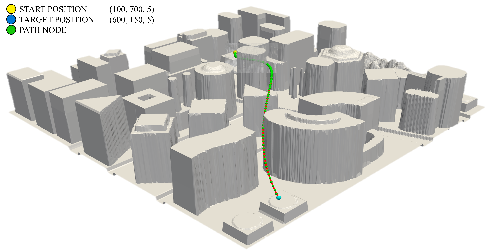
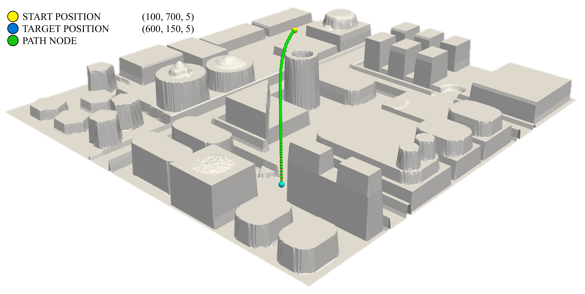
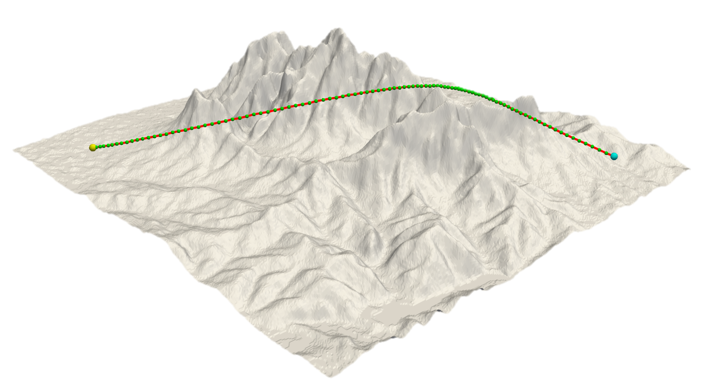

# Hybrid UAV Path Planning with Improved PSO and Rope Converging
This repository implement a hybrid path planning solution for transport UAVs. The method combines an improved PSO for global searching with a physics-inspired Rope model for local path refinement, the algorithm generates smooth, collision-free, and dynamically feasible flight paths in challenging 3D environments created from real-world map data. 
[](https://opensource.org/licenses/MIT)

## 📖 Contents Overview
* [Project Goal](#-project-goal)
* [Core Concepts](#-core-concepts)
* [Repository Structure](#-repository-structure)
* [Installation](#-installation)
* [How to Use](#-how-to-use)
* [Visualization](#-visualization)

## ⚓ Project Objective

The primary objective of this project is to develop a robust path planning solution for transport UAVs operating in low-altitude environments with complex terrain and obstacles. The algorithm is designed to:
1.  **Globally Search** for an initial, collision-free path using an **Improved Particle Swarm Optimization (PSO)** algorithm, which features a dynamic, diversity-aware inertia weight to escape local optima.
2.  **Locally Refine** the coarse path from PSO using a **Rope-Inspired Model**. This model treats the path as a virtual elastic rope, applying tension and smoothing forces to iteratively shorten and smoothen the trajectory until it converges to a locally optimal state.
3.  **Ensure Feasibility** by continuously checking against a 3D digital elevation map and UAV kinematic constraints.

## ✨ Core Concepts

The hybrid algorithm operates in two main phases:

1.  **PSO Global Search**: A population of candidate paths (particles) explores the 3D space. An improved PSO algorithm with adaptive inertia weight and early-stopping mechanisms efficiently finds a general, obstacle-free route from the start to the target point.
2.  **Elastic Rope Refinement**: The best path from the PSO phase is then optimized. It is modeled as a series of nodes connected by virtual springs. The optimizer applies simulated physical forces (tension and smoothness) to pull the path taut, straighten unnecessary turns, and ensure it remains clear of obstacles. *Note: The full hybrid integration connecting PSO with the Elastic Optimizer is a key area for future development based on the separate modules provided.*

## 📁 File Structure & Description

The repository contains a collection of scripts that handle different parts of the path planning pipeline.

#### Core Logic & Algorithm
* **`PSO.py`**: Defines the main `PSO` class, which orchestrates the entire optimization process. It initializes the drone, environment, and particle population.
* **`defParticle.py`**: Contains the `init_particles` function, responsible for creating the initial population of candidate paths between the start and end points.
* **`iteratePSO.py`**: Implements the main `Iterate` function, which contains the core PSO loop. This version includes enhancements like early stopping and dynamic parameter adjustment to improve search efficiency.
* **`update.py`**: Provides the `update_velocity` and `update_position` functions, which define the mathematical rules for how each particle moves in the search space.
* **`calFitness.py`**: Contains the crucial `cost_function`. It evaluates the quality of a given path by calculating its total length and adding a significant penalty for any collisions with terrain or obstacles.
* **`ElasticOptimizer.py`**: Implements the `ElasticPathOptimizer` class. This is a separate, self-contained module for local path smoothing and refinement.

#### Environment & Visualization
* **`defMap.py`**: A utility script to process 2D map images (like `.tiff` or `.jpg`) into 3D heightmaps. It uses interpolation to create a continuous 3D surface and can save the result as a `.vtk` file for 3D visualization.
* **`map_selector.py`**: An interactive GUI tool built with `tkinter` and `matplotlib`. It displays a 2D map and allows the user to visually select start and target coordinates for the path planning task.

#### Main Script & Demos
* **`Script_main.py`**: **This is the main entry point for the project.** It integrates all the above modules to run a full simulation: loading the map, selecting points, running the PSO, and visualizing the final 3D path.
* **`pso_demo.py`** & **`rope_model2.py`**: Standalone demonstration scripts used to validate and visualize the individual performance of the improved PSO algorithm on benchmark functions and the interactive behavior of the elastic rope model.

## ⚙️ Required Libraries & Setup

**Create a Virtual Environment (Recommended):**
  ```bash
  python -m venv venv
  source venv/bin/activate  # On Windows use `venv\Scripts\activate`
  ```
**Install Dependencies:**
  This project requires several libraries for scientific computing, 3D visualization, and data processing. 
  
  ```
  numpy
  scipy
  matplotlib
  scikit-image
  scikit-learn
  pyvista
  rasterio
  Pillow
  ```
  Install them all using pip:
  ```bash
  pip install -r requirements.txt
  ```
*Note on `tkinter`: The interactive map selector (`map_selector.py`) uses the `tkinter` library. This is typically included with standard Python installations on Windows and macOS. On some Linux distributions, you may need to install it separately. For example, on Debian/Ubuntu, run: `sudo apt-get install python3-tk`.*

4.  **Prepare Data:**
    * Create a `map` folder in the root directory and place your map files (e.g., `Mountainous Terrain.tiff`) inside it.
    * Create a `3D Env` folder for storing generated 3D models (e.g., `.vtk` files).

## 🚀 Run and Test

The main entry point for running a full path planning simulation is **`Script_main.py`**.

1.  **Configure the Map:**
    Open `Script_main.py` and ensure the `filepath` variable points to the correct map file you want to use (e.g., `filepath = "map/Mountainous Terrain.tiff"`).

2.  **Run the Main Script:**
    Execute the script from your terminal:
    ```bash
    python Script_main.py
    ```
3.  **Select Points:**
    A window will pop up displaying your 2D map, along with a separate input box. Use the map to identify your desired coordinates and enter them into the "Start Position" and "Target Position" fields in the input box. Click "Confirm".

4.  **Watch the Simulation:**
    The script will then:
    * Construct the 3D environment.
    * Initialize the PSO algorithm.
    * Run the PSO iterations to find an optimal path. The console will print updates when a new global best path is found.
    * Once the optimization is complete, a **PyVista** window will open, displaying the final 3D path.

## 📊 Visualization

The project uses **PyVista** for high-quality, interactive 3D visualization. The `Script_main.py` script automatically generates a 3D plot upon completion, showing the terrain, obstacles, and the final planned UAV trajectory. You can rotate, pan, and zoom within the PyVista window to inspect the path from any angle.

### Two Dimensional Map file in .tiff format:


### Three Dimensional Map
The 3D grid scene is constructed by interpreting the grayscale intensity at each pixel coordinate of a 2D image as elevation data.


Below are some examples of the final planned paths generated by the hybrid algorithm in the three representative test scenarios.

### Example Results in Different Scenarios

| Scenario | Final Planned Path |
| :--- | :--- |
| **Urban Environment** <br> A dense city map with complex building layouts, testing the algorithm's ability to navigate tight corridors. |  |
| **Industrial Zone** <br> A suburban area with scattered, large structures, focusing on efficient pathing between obstacles. |  |
| **Mountainous Terrain** <br> A large-scale, non-flat terrain, challenging the algorithm's ability to manage elevation changes and maintain smoothness. |  |


### Core References

This list includes the core academic papers that form the theoretical foundation for this project's algorithms.

#### Particle Swarm Optimization (PSO)

1.  **[Original PSO Paper]** Kennedy, J., & Eberhart, R. (1995). Particle swarm optimization. In *Proceedings of ICNN'95 - International Conference on Neural Networks* (Vol. 4, pp. 1942-1948).
2.  **[Improved PSO - Ref. 1]** 张姝, & 汤淼. (2023). 改进PSO算法及在无人机路径规划中的应用. *计算机系统应用*, 32(3), 330-337.
3.  **[Improved PSO - Ref. 2]** 谢勇宏, & 孔月萍. (2022). 基于改进粒子群算法的三维路径规划. *计算机测量与控制*, 30(3), 179-182.
4.  **[Evolutionary Computation Survey]** Jiang, Y., Xu, X. X., Zheng, M. Y., & Zhan, Z. H. (2024). Evolutionary computation for unmanned aerial vehicle path planning: a survey. *Artificial Intelligence Review*, 57, 267.

#### Elastic Rope/Band & Active Contour Models

5.  **[Pioneering "Elastic Bands" Paper]** Quinlan, S., & Khatib, O. (1993). Elastic bands: Connecting path planning and control. In *Proceedings of the 1993 IEEE International Conference on Robotics and Automation* (pp. 802-807).
6.  **[Elastic Rope Algorithm Application]** Tian, J., Wang, Y., & Yuan, D. (2019). An Unmanned Aerial Vehicle Path Planning Method Based on the Elastic Rope Algorithm. In *2019 IEEE 10th International Conference on Mechanical and Aerospace Engineering (ICMAE)* (pp. 137-141).
7.  **[Original "Snakes" Model]** Kass, M., Witkin, A., & Terzopoulos, D. (1988). Snakes: Active contour models. *International Journal of Computer Vision*, 1(4), 321-331.
